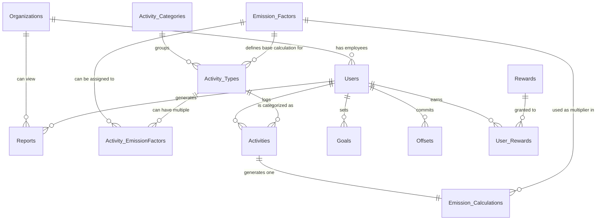

# Database Entity-Relationship Diagram

```mermaid
erDiagram
    Organizations ||--o{ Users : "has employees"
    Organizations ||--o{ Reports : "can view"
    
    Activity_Categories ||--o{ Activity_Types : "groups"
    Emission_Factors ||--o{ Activity_Types : "defines base calculation for"
    Emission_Factors ||--o{ Activity_EmissionFactors : "can be assigned to"
    
    Users ||--o{ Activities : "logs"
    Users ||--o{ Goals : "sets"
    Users ||--o{ Offsets : "commits"
    Users ||--o{ User_Rewards : "earns"
    Users ||--o{ Reports : "generates"
    
    Activity_Types ||--o{ Activities : "is categorized as"
    Activity_Types ||--o{ Activity_EmissionFactors : "can have multiple"
    
    Activities ||--|| Emission_Calculations : "generates one"
    Emission_Factors ||--o{ Emission_Calculations : "used as multiplier in"
    
    Rewards ||--o{ User_Rewards : "granted to"
```
